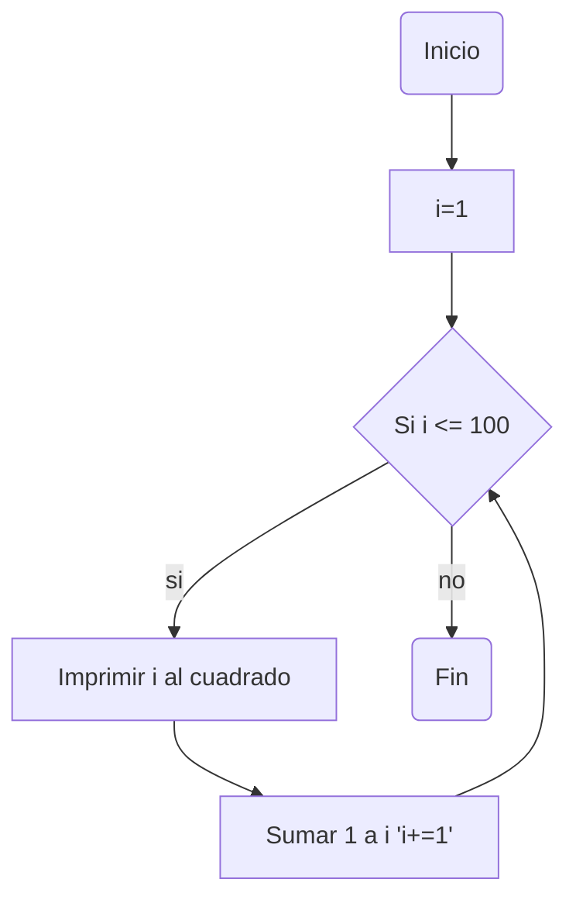
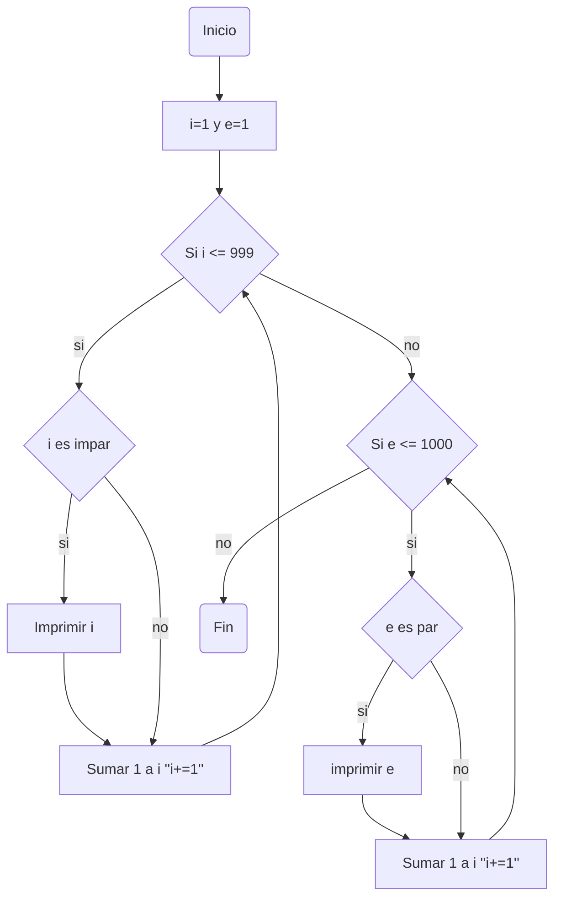
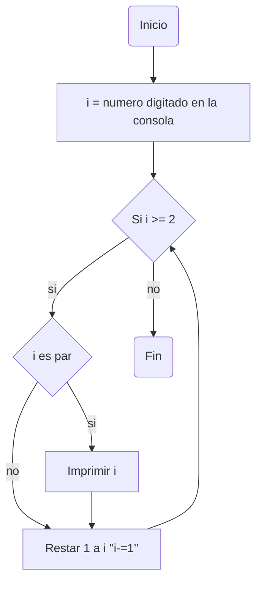

# Reto_7
Por: Juan Diego Cárdenas Olarte
### Grupo: 
#### Infinity Bit Team (∞BT)

[](https://postimg.cc/JyJWLCVV)

Este repositorio contiene todos los ejercicios planteados del reto 7 del curso de programación.

>### Punto 1.
>Imprimir un listado con los números del 1 al 100 cada uno con su respectivo cuadrado.
```python
i=1 #Desde este numero se inicia
while (i<=100): #Define las condiciones del bucle (hasta que i=100)
    print(i**2) # imprime en consola i al cuadrado
    i+=1 # Adiciona uno a i cada que se inicia el bucle
```
#### Diagrama de flujo:

>### Punto 2.
>Imprimir un listado con los números impares desde 1 hasta 999 y seguidamente otro listado con los números pares desde 2 hasta 1000.

```python
print ("Estos son los impares: ") 
i=1 # Se declara la variable usada para los numeros impares
e=1 # Se declara la variable usada para los numeros pares
while (i<=999): #Se defiinen las condiciones del bucle (Que i sea menor o igual a 999)
    if i%2 != 0: #Condicion que limita los numeros que aparecen a solo los impares
        print(i #Imprime el numero corespondiente
    i+=1 #Adiciona uno a i cada que se ejecute el bucle
print ("Estos son los pares: ")
while (e<=1000): #Se defiinen las condiciones del bucle (Que e sea menor o igual a 1000)
    if e%2 == 0: #Condicion que limita los numeros que aparecen a solo los pares
        print (e) #Imprime el numero corespondiente
    e+=1 #Adiciona uno a e cada que se ejecute el bucle
```
Diagrama de flujo para este codigo:



>### Punto 3.
>Imprimir los números pares en forma descendente hasta 2 que son menores o iguales a un número natural n ≥ 2 dado

```python
i=int(input("Escribe un numero entero: ")) #Inicializa y compila una variable "i" desde la consola
while (i>=2): #Se defiinen las condiciones del bucle (Que i sea mayor o igual a 2)
    if i%2 == 0: #Condicion que limita los numeros que aparecen a solo los pares
        print (i) # imprime el numero
    i-=1 #Resta uno a i cada que se ejecuta el codigo
```
Diagrama de flujo de este punto:


>### Punto 4.

```python
i=1
e=1
pais_a: int= 25000000
pais_b: int= 19800000
while (pais_b<=pais_a):
    pais_a+=pais_a*0.02
    pais_b+=pais_b*0.03
    i+=1
año:int=i+2022
print(f"La población del pais b superara a la del pais a en el año {año}")
```

>### Punto 5.

```python
i=int(input("Escribe un numero entero: "))
factorial:int=1
while (i>=2):
    factorial*=i
    i-=1
print(factorial)

```

>### Punto 6.

```python
import random
if __name__== "__main__":
    numero:int=random.randint(1,100)
    intento=int(input("Intenta adivinar un numero entre 1 y 100: "))
    while intento!=numero:
    
        if intento>numero:
            print("El numero buscado es menor")
        else:
            print("El numero buscado es mayor")
        intento=int(input("Intenta de nuevo: "))
    print("El numero es correcto")
```

>### Punto 7.

```python
import random
numero:int= random.randint(2,50)
guardar=numero
while (guardar>0):
    if numero%guardar == 0:
        print(guardar)
    guardar-=1
```

>### Punto 8.

```python

```
