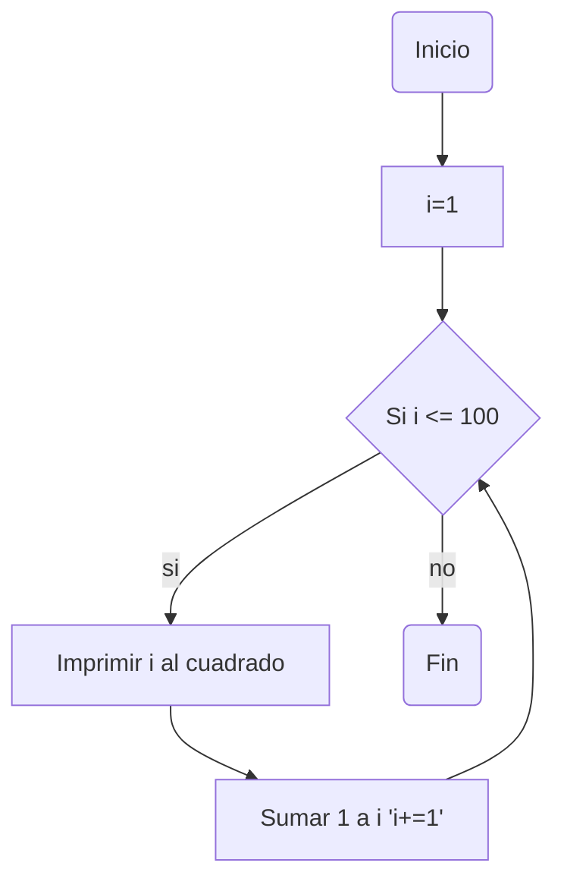
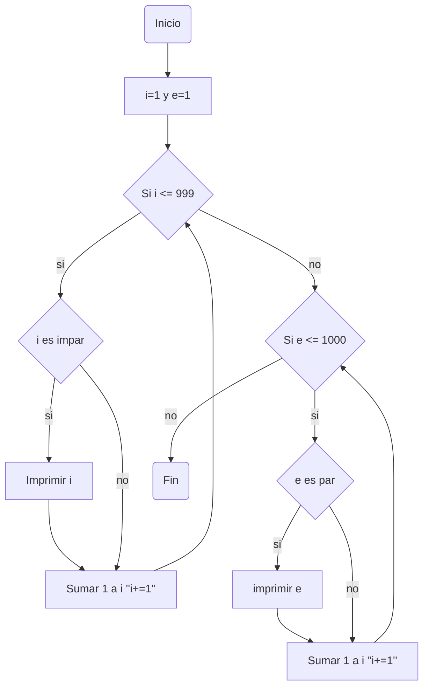
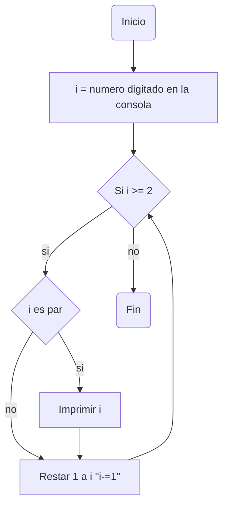

# Reto_7
Por: Juan Diego Cárdenas Olarte
### Grupo: 
#### Infinity Bit Team (∞BT)

[](https://postimg.cc/JyJWLCVV)

Este repositorio contiene todos los ejercicios planteados del reto 7 del curso de programación.

>### Punto 1.
>Imprimir un listado con los números del 1 al 100 cada uno con su respectivo cuadrado.
```python
i=1 #Desde este numero se inicia
while (i<=100): #Definen las condiciones del bucle (hasta que i=100)
    print(i**2) # imprime en consola i al cuadrado
    i+=1 # Adiciona uno a i cada que se inicia el bucle
```
#### Diagrama de flujo:

>### Punto 2.
>Imprimir un listado con los números impares desde 1 hasta 999 y seguidamente otro listado con los números pares desde 2 hasta 1000.

```python
print ("Estos son los impares: ") 
i=1 # Se declara la variable usada para los numeros impares
e=1 # Se declara la variable usada para los numeros pares
while (i<=999): #Se definen las condiciones del bucle (Que i sea menor o igual a 999)
    if i%2 != 0: #Condicion que limita los numeros que aparecen a solo los impares
        print(i #Imprime el numero corespondiente
    i+=1 #Adiciona uno a i cada que se ejecute el bucle
print ("Estos son los pares: ")
while (e<=1000): #Se definen las condiciones del bucle (Que e sea menor o igual a 1000)
    if e%2 == 0: #Condicion que limita los numeros que aparecen a solo los pares
        print (e) #Imprime el numero corespondiente
    e+=1 #Adiciona uno a e cada que se ejecute el bucle
```
Diagrama de flujo para este codigo:



>### Punto 3.
>Imprimir los números pares en forma descendente hasta 2 que son menores o iguales a un número natural n ≥ 2 dado

```python
i=int(input("Escribe un numero entero: ")) #Inicializa y declara una variable "i" desde la consola
while (i>=2): #Se definen las condiciones del bucle (Que i sea mayor o igual a 2)
    if i%2 == 0: #Condicion que limita los numeros que aparecen a solo los pares
        print (i) # imprime el numero
    i-=1 #Resta uno a i cada que se ejecuta el codigo
```
Diagrama de flujo de este punto:


>### Punto 4.
>En 2022 el país A tendrá una población de 25 millones de habitantes y el país B de 18.9 millones. Las tasas de crecimiento anual de la población serán de 2% y 3% respectivamente. Desarrollar un algoritmo para informar en que año la población del país B superará a la de A.

```python
i=1 # Se inicializa la variable i con valor 1
pais_a: int= 25000000 #Se define el valor inicial de la variable "pais_a" con valor 25000000
pais_b: int= 19800000 #Se define el valor inicial de la variable "pais_b" con valor 19800000
while (pais_b<=pais_a): #Se definen las condiciones del bucle (Que pais_b sea menor o igual a pais_a)
    pais_a+=pais_a*0.02 #Se añade a pais_a su 2% cada que se ejecuta el bucle
    pais_b+=pais_b*0.03 #Se añade a pais_b su 3% cada que se ejecuta el bucle
    i+=1 #Se añade uno a i cada que se ejecuta el bucle
año:int=i+2022 # Se adiciona a 2022 el numero de años resultantes del bucle (i=numero de años)
print(f"La población del pais b superara a la del pais a en el año {año}")
```

>### Punto 5.
>Imprimir el factorial de un número natural n dado.

```python
i=int(input("Escribe un numero entero: ")) #Inicializa y declara una variable "i" desde la consola
factorial:int=1 # Se inicializa y declara una variable "factorial" con valor 1
while (i>=2): #Se definen las condiciones del bucle (Que pais_b sea menor o igual a pais_a)
    factorial*=i #Se multiplica i por factorial cada que se ejecute el bucle
    i-=1 #Se resta 1 a i cada que se ejecute el bucle
print(factorial) #Se imprime el resultado (factorial)

```

>### Punto 6.
>Implementar un algoritmo que permita adivinar un número dado de 1 a 100, preguntando en cada caso si el número es mayor, menor o igual.

```python
import random #Se importa la funcion random
if __name__== "__main__":  #Comprueba si el script se está ejecutando como main
    numero:int=random.randint(1,100) #Se declara e inicializa una variable con un valor aleatorio dentro de un rango (1,100) mediante "random.randit"
    intento=int(input("Intenta adivinar un numero entre 1 y 100: ")) #Se declara e inicializa una variable con un valor designado desde consola
    while intento!=numero: #Se definen las condiciones del bucle (Que intento y numero sean diferentes)
        if intento>numero: # Condicion que pemite definir si la variable "intento" es menor a la variable "numero"
            print("El numero buscado es menor")
        else: # Pemite definir si la variable "intento" es mayor a la variable "numero"
            print("El numero buscado es mayor")
        intento=int(input("Intenta de nuevo: ")) # Cambia el valor de la variable "intento" cada que se ejecuta el bucle
    print("El numero es correcto") #Se imprime cuando el numero es correcto
```

>### Punto 7.
>Implementar un programa que ingrese un número de 2 a 50 y muestre sus divisores.

```python
import random #Se importa la funcion random
numero:int= random.randint(2,50) #Se declara e inicializa una variable con un valor aleatorio dentro de un rango (2,50) mediante "random.randit"
guardar=numero # Se inicializa la funcion "guardar" con el mismo valor de numero antes del loop 
while (guardar>0): #Se definen las condiciones del bucle (Que guardar sea mayor a 0)
    if numero%guardar == 0: #Condicion que limita los numeros que aparecen a solo los divisores de "numero"
        print(guardar) #Imprimir "guardar"
    guardar-=1 #Resta uno a "guardar" cada que se ejecuta el codigo
```

>### Punto 8.
>Implementar el algoritmo que muestre los números primos del 1 al 100. Nota: use funciones

```python

```
